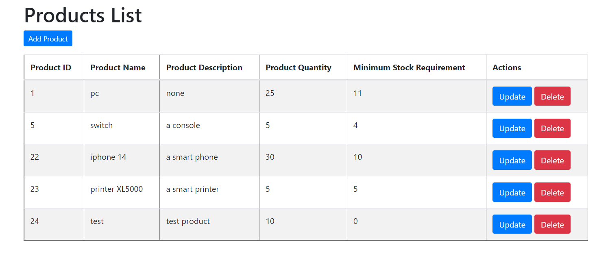
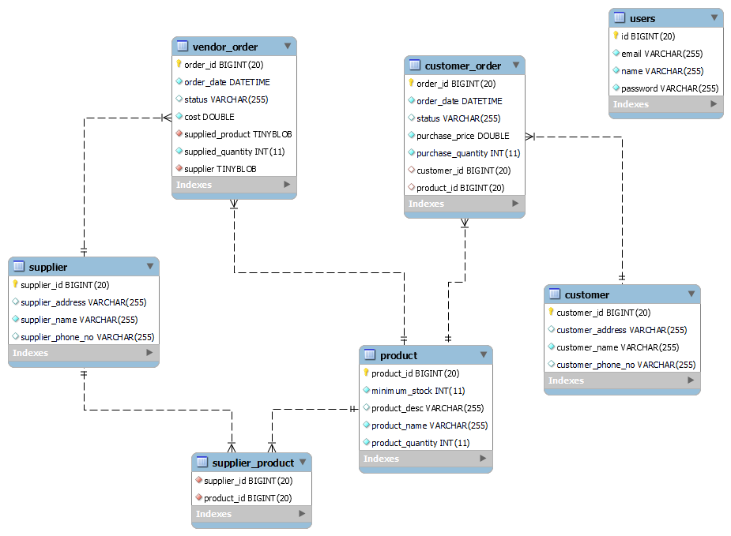
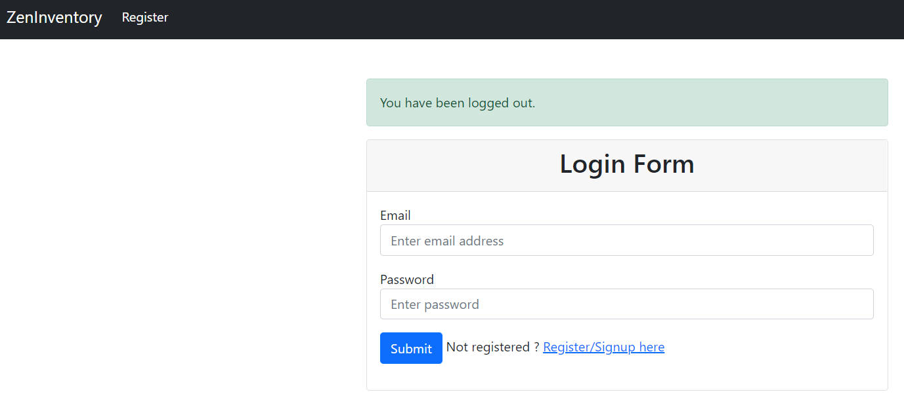

# ZenInventory
ZenInventory is an online inventory management tool that aims to provide business owners a digitized, logical, and systematic process to control the inward and outward flow of inventory stock. 

#### What is the goal?
- To build an inventory management System for business owners
- case study link: https://docs.google.com/document/d/1w_hfEKaTbIXq9gXj6MSU9G5tJ0Vsf92Au2KFHWwkHlY/edit

#### What tech stack are we using?
- Java, Spring Boot, Spring Web, Spring Security, JUnit 5, slf4j
- Hibernate, MariaDB/MySQL, H2Database(in memory testing)
- Thymeleaf, HTML/CSS, JavaScript

#### What is the design pattern?
- Spring MVC pattern
- Entities {customers, suppliers, products, customer/vendor orders}
- Repository -> Service - > ServiceImpl -> Controller
- Thymeleafs html pages for views

#### What functionalities are currently being developed/supported?
- Customer management
- Supplier management
- Order management (currently developing more features)
- Secure login management

#### What is the plan for future developments?
- User privilege dependency
- supplier price comparisons
- Customer recent order search
- Import/export function
- Shipment status report

## How to run
- git clone https://github.com/leon2968/ZenInventory.git
- modify datasource in src\main\resources\application.properties
- run the application in IDE as spring boot application
- use http://localhost:8080/login to login/register

